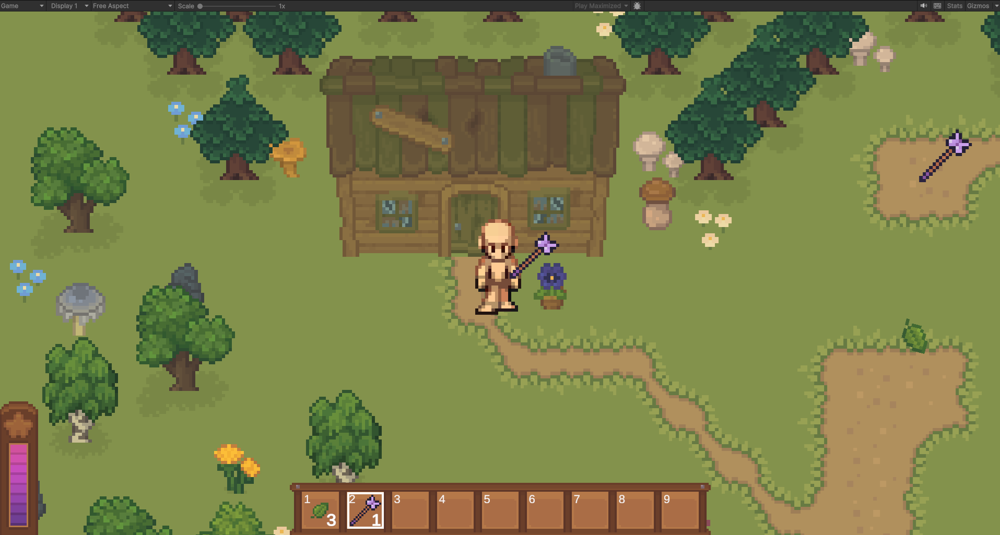

## PR #33 - Misc from tutorial (2025-09-05)

### What's changed
- Goat and bunny creatures 
- Creatures are animated and are happy to see you and chase you until you pet them
- Placeholder guard NPC exists
- An NPC walks around randomly within an area
- If player interacts with NPC, a dialogue box appear
- Signs exist
- If player interacts with sign, a dialogue box appears
- Refactored some code (more changes to come)

### Notes
Fixed some bugs too, yay we're learning.

### Images

---

## PR #25 - Other creatures (2025-05-31)

### What's changed
- The camera stops at the corner of the map and has an intentional delay
- Misc improvements to tiles and settings

---

## PR #23 - Pimp up the ouside (2025-05-30)

### What's changed
- Make outside bigger and prettier
- Improve tile pivot points and custom colliders
- Decreased player friction
- Try fix dev-log workflow

---

## PR #19 - Event and outdoors (2025-05-27)

### What's changed
- Added a placeholder area for outside the castle
- Added scene transition logic
- Refactored inventory system so an inventory can exist independently of a player
- Refactored inventory system so inventory items exist independently of UI and are preserved between scenes
- Resliced a ton of tiles (I think it actually took me hours)

### Notes
Shout out to this guy, along with Github Copilot: https://www.youtube.com/watch?v=wNl--exin90&list=PL4vbr3u7UKWp0iM1WIfRjCDTI03u43Zfu&index=30

I will eventually smoothen the current scene transition with a fade-in / fade-out effect.

### Images

---

## PR #14 - Initial setup (2025-05-22)

### What's changed
- Setting up the Unity project with GitHub.
- A placeholder character Sprite with animations
- A placeholder room with purchased assets
- Basic collissions and gravity
- Basic sprite sorting logic
- A toggleable inventory and toolbar
- The abilty to pick up and drop items
- A manabar
- A magic wand with a wand-swing animation which produces flowers

### Notes
Shout-out to:

- Great beginner tutorial: https://www.youtube.com/watch?v=ZPYrdKMDsGI&list=PL4PNgDjMajPN51E5WzEi7cXzJ16BCHZXl&index=1
- Bugfix (glitchy tilemap): https://www.youtube.com/watch?v=Wf98KrAyB2I&t=29s

Assets:

- Free placeholder character base sprite: https://seliel-the-shaper.itch.io/character-base
- Purchased Assets:
    - Tavern and Magical Assets for RPG
    - 100 Nature Things

### Images

---

## Project start (2024-11-13)

### What's changed
- Created a Unity project
- Basic character controls
- I made the Character Sprite myself, can you tell? (lol)

